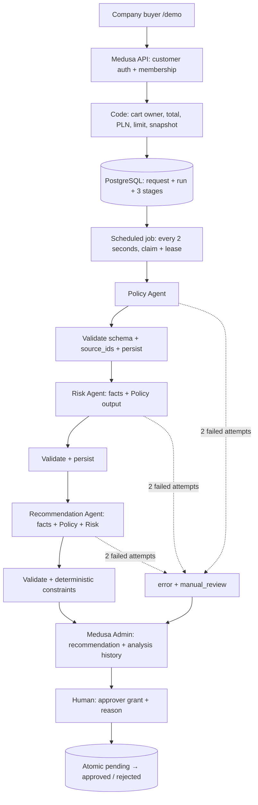

# Architecture — AI-Assisted B2B Order Approval

## Responsibilities

Medusa 2.21.2 supplies authentication, customers, Admin users, carts, modules, workflows and the Admin extension. The custom `approval` module adds a minimal company, membership, grant, request and persistent analysis model. PostgreSQL is the source of truth. The local demo does not need a separate agent framework or Redis.



`src/workflows/analysis.ts` defines Policy → Risk → Recommendation → finalize. Every stage has a persistent input/output boundary. The model never calls the decision endpoint or write tools. Recommendation provides advice, not a purchase command.

## Contracts

`src/agents/contracts.ts` defines Zod validation and the corresponding JSON Schema for OpenAI Structured Outputs. Each stage receives:

```ts
{
  schema_version: "1",
  agent: "policy" | "risk" | "recommendation",
  facts: { /* computed, minimised purchase facts */ },
  previous: { /* validated outputs from earlier stages only */ }
}
```

Policy has empty `previous`; Risk receives Policy; Recommendation receives both. Outputs loaded from PostgreSQL during recovery are validated again. All agents return the same contract:

```ts
{
  schema_version: "1",
  agent: "policy" | "risk" | "recommendation",
  recommendation: "approve" | "reject" | "manual_review",
  rationale: string,
  findings: [{ code: string, severity: "info" | "attention" | "block",
               explanation: string, source_ids: string[] }],
  uncertainty: string[]
}
```

Fields are required; additional fields are rejected. Text and finding counts are bounded. Validation checks the stage identity and every source reference. Invalid raw responses are not saved to history. React renders text without executing model HTML. Source IDs prove a reference to a supplied fact, not the correctness of the model's interpretation.

## Code versus model

Code checks JWT/session, membership, permissions, cart ownership and state, the Medusa Query total and currency. Conversion from Medusa's PLN major units to minor units is explicit. Clients cannot select the company, amount, limit, decision actor or model.

Code determines allowed categories, required cost centre/purpose, high value (>5× limit) and possible duplicates (the same purchasing reference in the company within 30 days). Missing data and prohibited categories also block approval in the API. Warnings or earlier reservations prevent unconditional `approve`. Agent failure produces `manual_review`; hard blockers still apply to human decisions.

The model interprets policy/purpose text and explains findings, uncertainty and a recommendation. It cannot calculate the authoritative total, assign permissions or change request status. A human may disagree with the model and must record a reason. Decisions are allowed after analysis completion or failure, never while it is running. A final request cannot be decided again.

## Persistence and failures

- The request and its first run with three stages are created in one transaction. Explicit MikroORM `flush` calls preserve FK insertion order without committing partial work.
- `AnalysisRun` stores prompt version, provider, model, facts snapshot, result and code constraints. `AgentStep` stores input/output; `AgentAttempt` stores each attempt, time, error and available tokens.
- Request statuses are `pending/approved/rejected`; analysis/stage statuses are `waiting/running/completed/error`. A recommendation is not a purchase status.
- The worker claims work through PostgreSQL `FOR UPDATE SKIP LOCKED`. A 90-second lease is renewed at attempt boundaries; a unique fencing token rejects writes from a stale worker.
- Attempt timeout defaults to 20 seconds, capped at 30. AbortController plus Promise.race also bound providers that ignore cancellation. Each stage has at most two attempts; subsequent stages record dependency errors when a stage fails.
- After restart, an expired lease can be reclaimed. Interrupted attempts become `worker_interrupted` and consume budget. Completed stages are not called again. The database queue survives the in-memory workflow engine.
- An authorised human can retry after failure, up to three runs. History is retained; a decision references a specific run. A request lock serialises concurrent retries.
- An external LLM call and a database commit are not one transaction. A crash after the call but before persistence can incur another charge. Provider execution is not claimed to be exactly-once. Tests cover lease takeover and stale writes, not actual crashes across multiple instances.

## Privacy and provider modes

Default `DemoProvider` is an explicit simulation: no network, key, tokens or invented costs. `OpenAIProvider` uses Responses API, `store: false`, strict JSON Schema and pinned `gpt-4.1-mini-2025-04-14`. The UI records the actual returned model, duration and input/output tokens. It does not estimate costs from a potentially outdated price list.

The model receives amounts, categories, required-field presence, purpose, policy, aggregate duplicates and earlier findings. It does not receive account emails, company names, customer/cart/request IDs or arbitrary metadata. Purpose/product text is untrusted data. Free-form production input needs additional personal-data redaction. `store: false` does not mean zero provider retention.

Credentials stay in ignored local `.env`, never in Admin, reports or Git. Changing providers affects new runs; existing runs retain their recorded provider/model.

## Enforced guardrails

Before **every** attempt, `preflight.ts` reloads the customer, membership, company and cart from Medusa. Identity and totals never come from prompts. Missing accounts/permissions, foreign/closed/changed carts or failed reads stop the call. Attempt reservation checks membership again inside the module transaction. Admin cannot approve such a request until a valid reanalysis succeeds.

The reservation transaction locks the request and counts attempts across all runs. The eight-call budget never resets on retry and includes failed/interrupted calls. Separate caps allow two attempts per stage and three runs. A manual retry-limit violation is committed before returning the HTTP error; throwing inside that transaction would erase the audit entry.

Beyond schema/version/enums/stage/source IDs, `validateOutput` rejects `approve` when there are blockers, mandatory review, uncertainty or earlier concerning findings. Rejected payloads are neither saved nor forwarded. Final `enforceRecommendation` is an additional check. Recovery revalidates earlier outputs too.

`approval_guardrail_violation` stores request/run/stage/attempt, phase, code, safe explanation and timestamp. Foreign keys retain the execution-history relationship. Schema/conflict/execution errors and limits appear in Admin. Repeated exhausted-retry clicks do not create unlimited duplicate entries. There is no public audit editing/deletion API.

The real `cart.items.product_description` is frozen in the snapshot, minimised and passed as `facts.untrusted_product_descriptions`. Text cannot determine authoritative categories or amounts. A simple English/Polish instruction detector adds mandatory review and an input violation. It is defence in depth, not a complete prompt-injection filter. Even undetected text has no permission to write decisions, change rules or expand the schema.

The `injection` DemoProvider scenario simulates a model following the malicious description. The actual validator rejects its output as `recommendation_conflict`. LIVE does not force that response; a real model may ignore the instruction correctly. Every final decision requires a separate authenticated human request, an approver grant and a reason. Providers receive only input and AbortSignal, never the Medusa container, Admin token, tools or decision function.

## Deliberate boundaries

This is Medusa without Mercur. Custom Company/Member/Approver entities replace a full B2B suite. A server-side context table supplies categories and purchasing data for real carts; there is no complete catalogue/policy editor. Demo references are unique; an integration test covers duplicates separately.

Approval applies to an immutable snapshot. It does not create an order, reserve inventory, take payment or block standard Medusa checkout. Checkout integration would need to revalidate cart/snapshot consistency. Sessions/event bus remain local. Production deployment and load testing have not been completed.

## Sources

- https://docs.medusajs.com/learn/fundamentals/workflows
- https://docs.medusajs.com/learn/fundamentals/scheduled-jobs
- https://docs.medusajs.com/learn/fundamentals/modules/db-operations
- https://developers.openai.com/api/docs/guides/structured-outputs
- https://developers.openai.com/api/docs/models/gpt-4.1-mini
